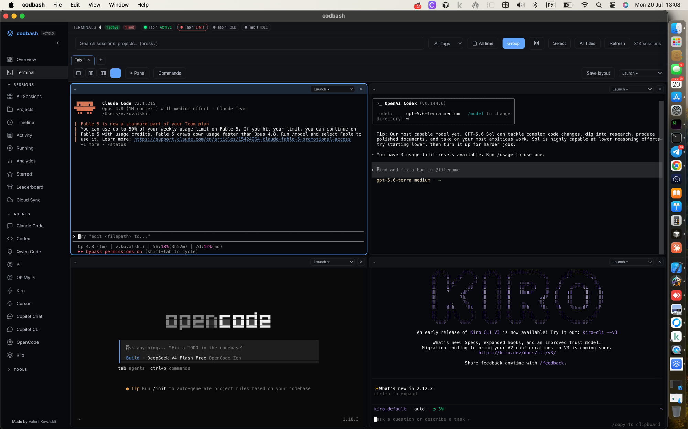

# Codbash

Control room for AI coding sessions. Search, replay, and resume Claude Code, Codex, Qwen, Pi, Oh My Pi, Cursor, OpenCode, Kiro, Kilo, and Copilot Chat sessions — and run them all side by side in a built-in terminal — without digging through scattered logs.

[Russian / Русский](docs/README_RU.md) | [Chinese / 中文](docs/README_ZH.md)



*The macOS desktop app running Claude Code, Codex, OpenCode and Kiro together in one Workspace.*

https://github.com/user-attachments/assets/15c45659-365b-49f8-86a3-9005fa155ca6

   

## Quick Start

```bash
npm i -g codbash-app
codbash run
```

Or grab the **macOS desktop app** from [Releases](https://github.com/vakovalskii/codbash/releases/latest) — signed & notarized, Apple Silicon (`-arm64.dmg`) and Intel (`.dmg`). It opens with no Gatekeeper warning.

## Supported Agents

| Agent | Sessions | Preview | Search | Live Status | Convert | Handoff | Launch |
|-------|----------|---------|--------|-------------|---------|---------|--------|
| Claude Code | JSONL | Yes | Yes | Yes | Yes | Yes | Terminal / cmux |
| Codex CLI | JSONL | Yes | Yes | Yes | Yes | Yes | Terminal |
| Pi | JSONL | Yes | Yes | Yes | - | Yes | Terminal |
| Oh My Pi | JSONL | Yes | Yes | Yes | - | Yes | Terminal |
| Cursor | JSONL | Yes | Yes | Yes | - | Yes | Open in Cursor |
| OpenCode | SQLite | Yes | Yes | Yes | - | Yes | Terminal |
| Kiro CLI | SQLite | Yes | Yes | Yes | - | Yes | Terminal |
| Copilot Chat | JSON/JSONL | Yes | Yes | - | - | Yes | - |

Also detects Claude Code running inside Cursor (via `claude-vscode` entrypoint).

## Features

**Overview** — the landing dashboard
- At-a-glance stats: total sessions, active agents, running terminals, spend (today + total)
- Recent sessions as clickable cards
- Live terminals grouped by project folder

**Workspace** — a real terminal in your browser
- Tabs + split panes (1–4 per tab), each an independent shell/agent
- Launch any agent or a saved command into a pane; save whole layouts
- "Open here" on any session card → opens a terminal in that project's folder with the agent's resume command prefilled
- Open up to 4 terminals cd'd into a project from the Projects view
- Terminals auto-name after their folder; double-click or the ✎ button to rename
- Confirms before closing live terminals; per-terminal status in the top bar
- Powered by xterm.js + a prebuilt `@lydell/node-pty` (optional); the core dashboard stays dependency-free

**Desktop App (macOS)**
- Native window around the same server — download the DMG from [Releases](https://github.com/vakovalskii/codbash/releases/latest)
- Checks for updates on launch (via GitHub Releases)
- Everything the CLI does, in an app (see [`desktop/`](desktop/))

**Browser Dashboard**
- Grid and List view with project grouping
- Trigram fuzzy search + full-text deep search across all supported message logs
- Filter by agent, tags, date range
- Star/pin sessions, tag with labels
- GitHub-style SVG activity heatmap with streak stats
- Session Replay with timeline slider and play/pause
- Hover preview + expandable cards
- Themes: Dark, Light, System

**Live Monitoring**
- LIVE/WAITING badges for terminal-launched agents when their processes can be matched
- Animated border on active session cards
- Running view with CPU, Memory, PID, Uptime
- Focus Terminal / Open in Cursor buttons
- Polling every 5 seconds

**Cost Analytics**
- Real cost from actual token usage when agents record usage (input, output, cache)
- Per-model pricing: Opus, Sonnet, Haiku, Codex, GPT-5
- Daily cost chart, cost by project, most expensive sessions

**Cross-Agent**
- Convert sessions between Claude Code, Codex, and Qwen formats
- Handoff: generate context document from any session with readable messages
- Install Agents: one-click install commands for supported agent CLIs

**CLI**
```bash
codbash run [--port=N] [--no-browser]
codbash search <query>
codbash show <session-id>
codbash handoff <id> [target] [--verbosity=full] [--out=file.md]
codbash convert <id> claude|codex|qwen
codbash list [limit]
codbash stats
codbash export [file.tar.gz]
codbash import <file.tar.gz>
codbash update
codbash restart
codbash stop
```

**Keyboard Shortcuts**: `/` search, `j/k` navigate, `Enter` open, `x` star, `d` delete, `s` select, `g` group, `r` refresh, `Esc` close

## Data Sources

```
~/.claude/                              Claude Code sessions + PID tracking
~/.codex/                               Codex CLI sessions
~/.cursor/projects/*/agent-transcripts/ Cursor agent sessions
~/.pi/agent/sessions/**/*.jsonl         Pi coding-agent sessions
~/.omp/agent/sessions/**/*.jsonl        Oh My Pi coding-agent sessions
~/.local/share/opencode/opencode.db     OpenCode (SQLite)
~/Library/Application Support/kiro-cli/ Kiro CLI (SQLite)
<vscode-user-data>/workspaceStorage/    Copilot Chat (JSON/JSONL)
  # Linux:   ~/.config/Code
  # macOS:   ~/Library/Application Support/Code
  # Windows: %APPDATA%\Code
```

Zero dependencies. Everything runs on `localhost`.

## Install Agents

```bash
curl -fsSL https://claude.ai/install.sh | bash          # Claude Code
npm i -g @openai/codex                                   # Codex CLI
curl -fsSL https://cli.kiro.dev/install | bash           # Kiro CLI
npm i -g @earendil-works/pi-coding-agent                 # Pi
curl -fsSL https://omp.sh/install | sh                    # Oh My Pi
bun install -g @oh-my-pi/pi-coding-agent                  # Oh My Pi (Bun)
curl -fsSL https://opencode.ai/install | bash            # OpenCode
```

## Requirements

- Node.js >= 18
- At least one AI coding agent installed
- macOS / Linux / Windows

## Contributing

`main` is protected. All changes go through feature branches and pull requests.

```bash
git checkout -b fix/my-fix
# make changes
git push -u origin fix/my-fix
gh pr create
```

- **Branch naming:** `feat/`, `fix/`, `chore/`, `release/`
- **1 approval** required to merge
- Keep PRs small and focused

See [ARCHITECTURE.md](docs/ARCHITECTURE.md) for codebase details.

## License

MIT
